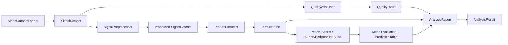

# Architecture Guide

## Design Direction

Version `0.2.0` deliberately resets the unreleased early workflow. The codebase exposes a small set of deep, typed boundaries and removes compatibility dictionaries and broad package-root convenience exports.

The governing rule is that structural complexity should be hidden behind cohesive modules:

- Keep numerical DSP kernels as focused functions because they are stateless and directly testable.
- Use immutable typed domain objects for identity, annotations, acquisition observations, segments, and processing decisions.
- Let composed collaborators own substantial policies: loading, preprocessing, feature extraction, quality assessment, scoring, reporting, and orchestration.
- Expose DataFrame copies for inspection and plotting, not as internal workflow contracts.
- Keep notebooks thin: orchestration and presentation only.

## Public Shape

The package root exposes only the main navigation concepts:

- `SignalRecord`, `SignalDataset`
- `ProjectConfig`, `AnalysisConfig`, `load_config`
- `SignalDatasetLoader`
- `SignalAnalysisPipeline`, `AnalysisResult`, `run_synthetic_analysis`

Specialist APIs are imported from their owning modules:

- `features.FeatureExtractor`
- `quality.QualityAssessor`
- `preprocessing.SignalPreprocessor`
- `modeling` scorer classes and `SupervisedBaselineSuite`
- `reporting.AnalysisReport`
- `autoencoders.SpectrogramAutoencoderExperiment`
- DSP and plotting functions

## Domain Ownership

`SignalRecord` is immutable and makes ownership explicit:

| Concern | Owner |
| --- | --- |
| Sample values and free-form user/generator context | `values`, `attributes` |
| Source path, format, signal column, dtype, channel identity | `SignalProvenance` |
| Sampling-rate inference, jitter, gaps, timing assumptions | `AcquisitionDiagnostics` |
| Split, sensor, anomaly state, intervals, joined annotation context | `RecordAnnotations` |
| Window or segment location | `SegmentSpan` |
| Filtering, interpolation, and other transformations | `ProcessingStep` history |

Record-owned arrays and nested mappings/sequences are copied and frozen. A derived record retains source identity and appends an explicit processing step or segment span.

No internal module should store or read annotation, preprocessing, channel, or window-position facts through compatibility metadata keys.

## Stage Boundaries

`SignalAnalysisPipeline` owns ordering, record failure policy, and collaborator composition. Configuration failures are never treated as corrupt records: `ConfigurationError` fails immediately, while explicitly skippable per-record failures use `RecordDataError`.

## Navigation

Start in:

- `pipeline.py` for a complete analysis.
- `records.py` for stable data ownership.
- `config.py` for supported policy.
- `data_loading.py` for the loader facade; format and annotation assembly are internal collaborators.
- `artifacts.py` for table roles and DataFrame view boundaries.
- `features.py`, `quality.py`, `preprocessing.py`, `modeling.py`, and `reporting.py` for replaceable workflow components.
- `frequency_domain.py`, `time_domain.py`, and `time_frequency.py` for calculation-level DSP behavior.

## Extension Rules

When adding a data format, extend the loading strategy and return canonical records. When adding a model, accept a `FeatureTable` and return a `ModelEvaluation` with a `PredictionTable`. When adding reporting content, consume typed artifacts or result views rather than reconstructing facts from record dictionaries.

Tests should be organized around these boundaries: immutable records, loader assembly, artifact validation, collaborator behavior, pipeline order and policy, and smoke workflows.
